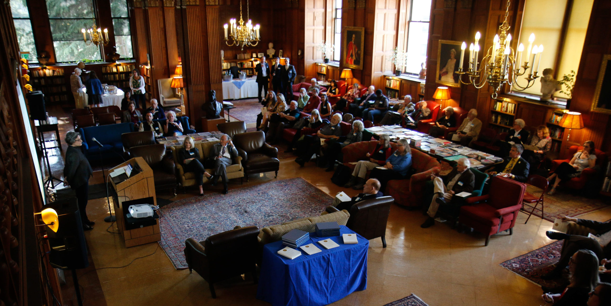

# Papers We ❤️ Berkeley

***

## What ?
As per the official PWL statement: "Papers We Love (PWL) is a community built around reading, discussing and learning more about academic computer science papers." [^1]

PWL is Berkeley a fairly new PWL chapter that aims to organize various events and gatherings around the same interests specifically on our campus. While the plan is to make PWL Berkeley officially recognised by the University of California, membership and attendance is not exclusive to campus communtiy members, and in fact anyone interestes is welcome to join 

## Who ?
We are a student group at UC Berkeley working hard to get out PWL chapter kickstarted. We would love for you to join us organize events on campus, and explore the depths of scientific research.

## Getting Involved
Please personally contact me at [saner@berkeley.edu](mailto:saner@berkeley.edu]) if you are interested in joining.

[^1]: https://github.com/papers-we-love/papers-we-love